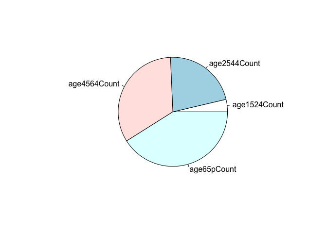
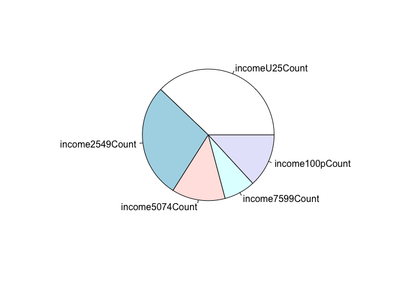
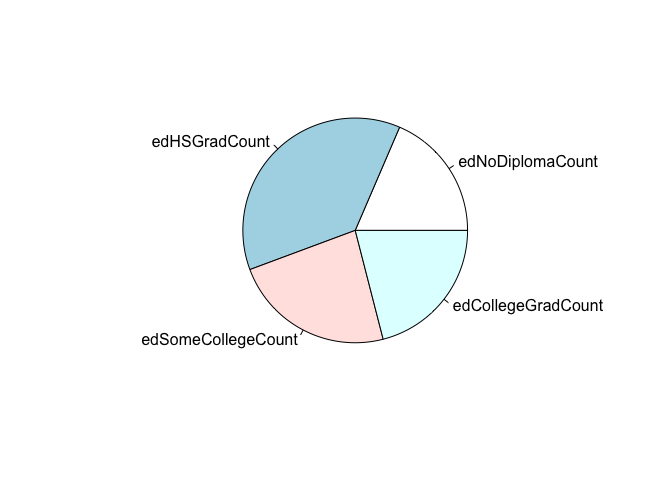
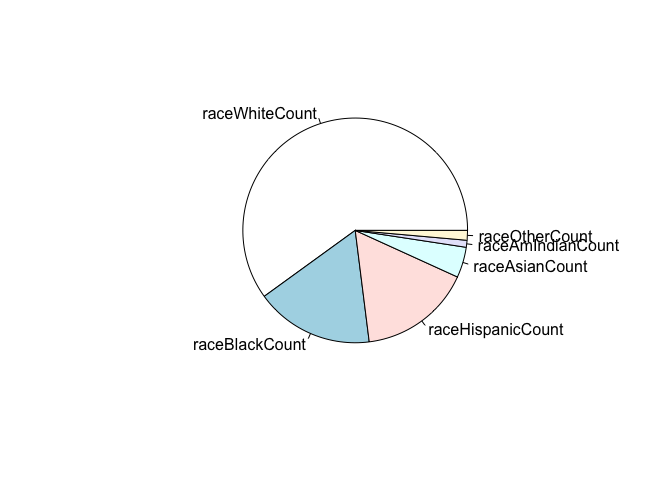
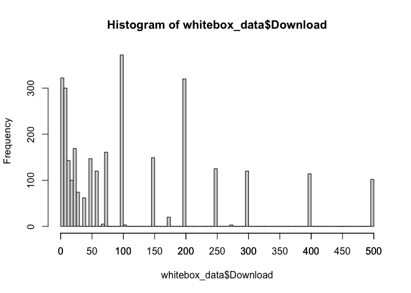
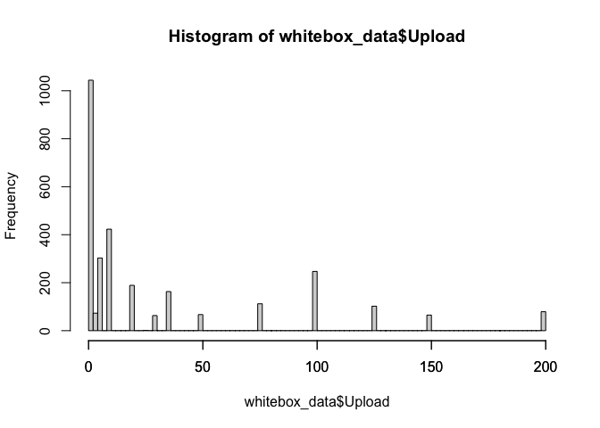

# Broadband policy 2021

This is all of the backend code for this paper. 

### Some data prep

Let's begin at basics. According to the [most recent survey data](https://www.pewresearch.org/fact-tank/2019/04/22/some-americans-dont-use-the-internet-who-are-they/) from Pew, about 10 percent of Americans aren't connected to the Internet. [As Pew noted](https://www.pewresearch.org/fact-tank/2019/04/22/some-americans-dont-use-the-internet-who-are-they/), "The size of this group has changed little over the past four years, despite ongoing government and social service programs to encourage internet adoption in underserved areas."

I pulled NTIA's Internet Use Survey data to do some analysis. The excel file is included. 


```r
NTIAraw <- read_excel("ntia-internet-use.xlsx", sheet = 1)
NTIAraw <- as.data.frame(NTIAraw)
NTIAraw$dataset <- as.Date(NTIAraw$dataset)
```

First, let's take a look at the variables.


```r
names(NTIAraw)
```

```
##   [1] "dataset"               "variable"              "description"          
##   [4] "universe"              "usProp"                "usPropSE"             
##   [7] "usCount"               "usCountSE"             "age314Prop"           
##  [10] "age314PropSE"          "age314Count"           "age314CountSE"        
##  [13] "age1524Prop"           "age1524PropSE"         "age1524Count"         
##  [16] "age1524CountSE"        "age2544Prop"           "age2544PropSE"        
##  [19] "age2544Count"          "age2544CountSE"        "age4564Prop"          
##  [22] "age4564PropSE"         "age4564Count"          "age4564CountSE"       
##  [25] "age65pProp"            "age65pPropSE"          "age65pCount"          
##  [28] "age65pCountSE"         "workEmployedProp"      "workEmployedPropSE"   
##  [31] "workEmployedCount"     "workEmployedCountSE"   "workUnemployedProp"   
##  [34] "workUnemployedPropSE"  "workUnemployedCount"   "workUnemployedCountSE"
##  [37] "workNILFProp"          "workNILFPropSE"        "workNILFCount"        
##  [40] "workNILFCountSE"       "incomeU25Prop"         "incomeU25PropSE"      
##  [43] "incomeU25Count"        "incomeU25CountSE"      "income2549Prop"       
##  [46] "income2549PropSE"      "income2549Count"       "income2549CountSE"    
##  [49] "income5074Prop"        "income5074PropSE"      "income5074Count"      
##  [52] "income5074CountSE"     "income7599Prop"        "income7599PropSE"     
##  [55] "income7599Count"       "income7599CountSE"     "income100pProp"       
##  [58] "income100pPropSE"      "income100pCount"       "income100pCountSE"    
##  [61] "edNoDiplomaProp"       "edNoDiplomaPropSE"     "edNoDiplomaCount"     
##  [64] "edNoDiplomaCountSE"    "edHSGradProp"          "edHSGradPropSE"       
##  [67] "edHSGradCount"         "edHSGradCountSE"       "edSomeCollegeProp"    
##  [70] "edSomeCollegePropSE"   "edSomeCollegeCount"    "edSomeCollegeCountSE" 
##  [73] "edCollegeGradProp"     "edCollegeGradPropSE"   "edCollegeGradCount"   
##  [76] "edCollegeGradCountSE"  "sexMaleProp"           "sexMalePropSE"        
##  [79] "sexMaleCount"          "sexMaleCountSE"        "sexFemaleProp"        
##  [82] "sexFemalePropSE"       "sexFemaleCount"        "sexFemaleCountSE"     
##  [85] "raceWhiteProp"         "raceWhitePropSE"       "raceWhiteCount"       
##  [88] "raceWhiteCountSE"      "raceBlackProp"         "raceBlackPropSE"      
##  [91] "raceBlackCount"        "raceBlackCountSE"      "raceHispanicProp"     
##  [94] "raceHispanicPropSE"    "raceHispanicCount"     "raceHispanicCountSE"  
##  [97] "raceAsianProp"         "raceAsianPropSE"       "raceAsianCount"       
## [100] "raceAsianCountSE"      "raceAmIndianProp"      "raceAmIndianPropSE"   
## [103] "raceAmIndianCount"     "raceAmIndianCountSE"   "raceOtherProp"        
## [106] "raceOtherPropSE"       "raceOtherCount"        "raceOtherCountSE"     
## [109] "disabilityNoProp"      "disabilityNoPropSE"    "disabilityNoCount"    
## [112] "disabilityNoCountSE"   "disabilityYesProp"     "disabilityYesPropSE"  
## [115] "disabilityYesCount"    "disabilityYesCountSE"  "metroNoProp"          
## [118] "metroNoPropSE"         "metroNoCount"          "metroNoCountSE"       
## [121] "metroYesProp"          "metroYesPropSE"        "metroYesCount"        
## [124] "metroYesCountSE"       "metroUnknownProp"      "metroUnknownPropSE"   
## [127] "metroUnknownCount"     "metroUnknownCountSE"   "scChldHomeNoProp"     
## [130] "scChldHomeNoPropSE"    "scChldHomeNoCount"     "scChldHomeNoCountSE"  
## [133] "scChldHomeYesProp"     "scChldHomeYesPropSE"   "scChldHomeYesCount"   
## [136] "scChldHomeYesCountSE"  "veteranNoProp"         "veteranNoPropSE"      
## [139] "veteranNoCount"        "veteranNoCountSE"      "veteranYesProp"       
## [142] "veteranYesPropSE"      "veteranYesCount"       "veteranYesCountSE"    
## [145] "ALProp"                "ALPropSE"              "ALCount"              
## [148] "ALCountSE"             "AKProp"                "AKPropSE"             
## [151] "AKCount"               "AKCountSE"             "AZProp"               
## [154] "AZPropSE"              "AZCount"               "AZCountSE"            
## [157] "ARProp"                "ARPropSE"              "ARCount"              
## [160] "ARCountSE"             "CAProp"                "CAPropSE"             
## [163] "CACount"               "CACountSE"             "COProp"               
## [166] "COPropSE"              "COCount"               "COCountSE"            
## [169] "CTProp"                "CTPropSE"              "CTCount"              
## [172] "CTCountSE"             "DEProp"                "DEPropSE"             
## [175] "DECount"               "DECountSE"             "DCProp"               
## [178] "DCPropSE"              "DCCount"               "DCCountSE"            
## [181] "FLProp"                "FLPropSE"              "FLCount"              
## [184] "FLCountSE"             "GAProp"                "GAPropSE"             
## [187] "GACount"               "GACountSE"             "HIProp"               
## [190] "HIPropSE"              "HICount"               "HICountSE"            
## [193] "IDProp"                "IDPropSE"              "IDCount"              
## [196] "IDCountSE"             "ILProp"                "ILPropSE"             
## [199] "ILCount"               "ILCountSE"             "INProp"               
## [202] "INPropSE"              "INCount"               "INCountSE"            
## [205] "IAProp"                "IAPropSE"              "IACount"              
## [208] "IACountSE"             "KSProp"                "KSPropSE"             
## [211] "KSCount"               "KSCountSE"             "KYProp"               
## [214] "KYPropSE"              "KYCount"               "KYCountSE"            
## [217] "LAProp"                "LAPropSE"              "LACount"              
## [220] "LACountSE"             "MEProp"                "MEPropSE"             
## [223] "MECount"               "MECountSE"             "MDProp"               
## [226] "MDPropSE"              "MDCount"               "MDCountSE"            
## [229] "MAProp"                "MAPropSE"              "MACount"              
## [232] "MACountSE"             "MIProp"                "MIPropSE"             
## [235] "MICount"               "MICountSE"             "MNProp"               
## [238] "MNPropSE"              "MNCount"               "MNCountSE"            
## [241] "MSProp"                "MSPropSE"              "MSCount"              
## [244] "MSCountSE"             "MOProp"                "MOPropSE"             
## [247] "MOCount"               "MOCountSE"             "MTProp"               
## [250] "MTPropSE"              "MTCount"               "MTCountSE"            
## [253] "NEProp"                "NEPropSE"              "NECount"              
## [256] "NECountSE"             "NVProp"                "NVPropSE"             
## [259] "NVCount"               "NVCountSE"             "NHProp"               
## [262] "NHPropSE"              "NHCount"               "NHCountSE"            
## [265] "NJProp"                "NJPropSE"              "NJCount"              
## [268] "NJCountSE"             "NMProp"                "NMPropSE"             
## [271] "NMCount"               "NMCountSE"             "NYProp"               
## [274] "NYPropSE"              "NYCount"               "NYCountSE"            
## [277] "NCProp"                "NCPropSE"              "NCCount"              
## [280] "NCCountSE"             "NDProp"                "NDPropSE"             
## [283] "NDCount"               "NDCountSE"             "OHProp"               
## [286] "OHPropSE"              "OHCount"               "OHCountSE"            
## [289] "OKProp"                "OKPropSE"              "OKCount"              
## [292] "OKCountSE"             "ORProp"                "ORPropSE"             
## [295] "ORCount"               "ORCountSE"             "PAProp"               
## [298] "PAPropSE"              "PACount"               "PACountSE"            
## [301] "RIProp"                "RIPropSE"              "RICount"              
## [304] "RICountSE"             "SCProp"                "SCPropSE"             
## [307] "SCCount"               "SCCountSE"             "SDProp"               
## [310] "SDPropSE"              "SDCount"               "SDCountSE"            
## [313] "TNProp"                "TNPropSE"              "TNCount"              
## [316] "TNCountSE"             "TXProp"                "TXPropSE"             
## [319] "TXCount"               "TXCountSE"             "UTProp"               
## [322] "UTPropSE"              "UTCount"               "UTCountSE"            
## [325] "VTProp"                "VTPropSE"              "VTCount"              
## [328] "VTCountSE"             "VAProp"                "VAPropSE"             
## [331] "VACount"               "VACountSE"             "WAProp"               
## [334] "WAPropSE"              "WACount"               "WACountSE"            
## [337] "WVProp"                "WVPropSE"              "WVCount"              
## [340] "WVCountSE"             "WIProp"                "WIPropSE"             
## [343] "WICount"               "WICountSE"             "WYProp"               
## [346] "WYPropSE"              "WYCount"               "WYCountSE"
```

I know there are two groups worth understanding, the connected and the unconnected. Let's filter the data to two groups to compare their means. 


```r
unconnected_connected <- filter(NTIAraw, variable == "noInternetAtHome" | variable == "internetAtHome" |
                                  variable == "isHouseholder", dataset == "2019-11-01") %>%
  subset(., select = -dataset)
```

We need to prep the data for some basic analysis, which means we need a list of variables to compare. We can then run a function over each one of them for a table. Let's collect all the variables we want to compare and also take out the standard errors. Thankfully, there are no errant R variables that include the capitalized SE, so let's use match case filtering here. 


```r
compare_variables <- as.data.frame(names(unconnected_connected)) %>%
  rename(demos = 'names(unconnected_connected)') %>%
  filter(!str_detect(demos, "SE")) %>%
  filter(!demos == c("dataset", "variable", "description", "universe"))
```

```
## Warning in demos == c("dataset", "variable", "description", "universe"): longer
## object length is not a multiple of shorter object length
```

I like reading rows of tables, so let's reshape the data into the long format.


```r
unconnected_connected_long <- unconnected_connected %>%
  rename(., connect = variable) %>%
  subset(., select = -c(description, universe)) %>%
  gather(., variable, value, usProp:WYCountSE, factor_key=TRUE) %>%
  spread(., connect, value) %>%
  semi_join(., compare_variables, c("variable" = "demos"))

unconnected_connected_long 
```

```
##                variable   internetAtHome isHouseholder noInternetAtHome
## 1                usProp         0.798777             1         0.201223
## 2               usCount 104069680.000000     130286349  26216669.000000
## 3            age314Prop               NA            NA               NA
## 4           age314Count               NA            NA               NA
## 5           age1524Prop         0.842545             1         0.157455
## 6          age1524Count   5172456.000000       6139084    966628.000000
## 7           age2544Prop         0.865837             1         0.134163
## 8          age2544Count  37260547.000000      43034143   5773596.000000
## 9           age4564Prop         0.812860             1         0.187140
## 10         age4564Count  37868997.000000      46587332   8718335.000000
## 11           age65pProp         0.688404             1         0.311596
## 12          age65pCount  23767680.000000      34525791  10758111.000000
## 13     workEmployedProp         0.854118             1         0.145882
## 14    workEmployedCount  68959792.000000      80738061  11778269.000000
## 15   workUnemployedProp         0.819769             1         0.180231
## 16  workUnemployedCount   1928667.000000       2352695    424028.000000
## 17         workNILFProp         0.701197             1         0.298803
## 18        workNILFCount  32782154.000000      46751687  13969533.000000
## 19        incomeU25Prop         0.612321             1         0.387679
## 20       incomeU25Count  15677265.000000      25603010   9925746.000000
## 21       income2549Prop         0.765254             1         0.234746
## 22      income2549Count  24062223.000000      31443440   7381217.000000
## 23       income5074Prop         0.853647             1         0.146353
## 24      income5074Count  20066170.000000      23506405   3440235.000000
## 25       income7599Prop         0.872555             1         0.127445
## 26      income7599Count  13784675.000000      15798061   2013386.000000
## 27       income100pProp         0.898157             1         0.101843
## 28      income100pCount  30479347.000000      33935433   3456085.000000
## 29      edNoDiplomaProp         0.579874             1         0.420126
## 30     edNoDiplomaCount   6706214.000000      11564947   4858733.000000
## 31         edHSGradProp         0.715019             1         0.284981
## 32        edHSGradCount  24426083.000000      34161448   9735365.000000
## 33    edSomeCollegeProp         0.834340             1         0.165660
## 34   edSomeCollegeCount  30816421.000000      36935096   6118675.000000
## 35    edCollegeGradProp         0.884432             1         0.115568
## 36   edCollegeGradCount  42120963.000000      47624858   5503895.000000
## 37          sexMaleProp         0.808168             1         0.191832
## 38         sexMaleCount  52544979.000000      65017426  12472447.000000
## 39        sexFemaleProp         0.789422             1         0.210578
## 40       sexFemaleCount  51524701.000000      65268923  13744222.000000
## 41        raceWhiteProp         0.815978             1         0.184022
## 42       raceWhiteCount  69731588.000000      85457641  15726053.000000
## 43        raceBlackProp         0.733397             1         0.266603
## 44       raceBlackCount  12267047.000000      16726336   4459288.000000
## 45     raceHispanicProp         0.768078             1         0.231922
## 46    raceHispanicCount  14065872.000000      18313079   4247207.000000
## 47        raceAsianProp         0.830104             1         0.169896
## 48       raceAsianCount   5632390.000000       6785165   1152775.000000
## 49     raceAmIndianProp         0.733796             1         0.266204
## 50    raceAmIndianCount    722989.000000        985272    262284.000000
## 51        raceOtherProp         0.817192             1         0.182808
## 52       raceOtherCount   1649794.000000       2018856    369062.000000
## 53     disabilityNoProp         0.825727             1         0.174273
## 54    disabilityNoCount  91790936.000000     111163842  19372907.000000
## 55    disabilityYesProp         0.636005             1         0.363995
## 56   disabilityYesCount  11879678.000000      18678601   6798923.000000
## 57          metroNoProp         0.735390             1         0.264610
## 58         metroNoCount  12865555.000000      17494866   4629311.000000
## 59         metroYesProp         0.808740             1         0.191260
## 60        metroYesCount  90379389.000000     111753288  21373899.000000
## 61     metroUnknownProp         0.794394             1         0.205606
## 62    metroUnknownCount    824736.000000       1038195    213459.000000
## 63     scChldHomeNoProp         0.775940             1         0.224060
## 64    scChldHomeNoCount  78224325.000000     100812385  22588060.000000
## 65    scChldHomeYesProp         0.876888             1         0.123112
## 66   scChldHomeYesCount  25845355.000000      29473964   3628609.000000
## 67        veteranNoProp         0.799579             1         0.200421
## 68       veteranNoCount  94415211.000000     118081191  23665980.000000
## 69       veteranYesProp         0.786661             1         0.213339
## 70      veteranYesCount   9196730.000000      11690845   2494116.000000
## 71               ALProp         0.803885             1         0.196115
## 72              ALCount   1654253.000000       2057823    403570.000000
## 73               AKProp         0.813520             1         0.186480
## 74              AKCount    217723.000000        267631     49908.000000
## 75               AZProp         0.835351             1         0.164649
## 76              AZCount   2347790.000000       2810542    462752.000000
## 77               ARProp         0.800515             1         0.199485
## 78              ARCount   1021040.000000       1275479    254438.000000
## 79               CAProp         0.799298             1         0.200702
## 80              CACount  11378020.000000      14235012   2856992.000000
## 81               COProp         0.877991             1         0.122009
## 82              COCount   2078052.000000       2366826    288774.000000
## 83               CTProp         0.788405             1         0.211595
## 84              CTCount   1142445.000000       1449059    306614.000000
## 85               DEProp         0.793487             1         0.206513
## 86              DECount    307748.000000        387842     80094.000000
## 87               DCProp         0.853313             1         0.146687
## 88              DCCount    293100.000000        343485     50385.000000
## 89               FLProp         0.781651             1         0.218349
## 90              FLCount   7172671.000000       9176306   2003635.000000
## 91               GAProp         0.783169             1         0.216831
## 92              GACount   3318541.000000       4237325    918784.000000
## 93               HIProp         0.869493             1         0.130507
## 94              HICount    431593.000000        496373     64780.000000
## 95               IDProp         0.840499             1         0.159501
## 96              IDCount    585159.000000        696205    111046.000000
## 97               ILProp         0.838505             1         0.161495
## 98              ILCount   4193312.000000       5000939    807627.000000
## 99               INProp         0.806705             1         0.193295
## 100             INCount   2164673.000000       2683353    518680.000000
## 101              IAProp         0.817370             1         0.182630
## 102             IACount   1071727.000000       1311190    239463.000000
## 103              KSProp         0.808202             1         0.191798
## 104             KSCount    936010.000000       1158139    222129.000000
## 105              KYProp         0.761706             1         0.238294
## 106             KYCount   1460989.000000       1918049    457059.000000
## 107              LAProp         0.756910             1         0.243090
## 108             LACount   1433929.000000       1894451    460523.000000
## 109              MEProp         0.800293             1         0.199707
## 110             MECount    471867.000000        589618    117751.000000
## 111              MDProp         0.858470             1         0.141530
## 112             MDCount   1967264.000000       2291594    324330.000000
## 113              MAProp         0.794179             1         0.205821
## 114             MACount   2293912.000000       2888407    594496.000000
## 115              MIProp         0.805534             1         0.194466
## 116             MICount   3338786.000000       4144812    806026.000000
## 117              MNProp         0.867765             1         0.132235
## 118             MNCount   1952164.000000       2249647    297483.000000
## 119              MSProp         0.755273             1         0.244727
## 120             MSCount    894324.000000       1184106    289782.000000
## 121              MOProp         0.801554             1         0.198446
## 122             MOCount   1936168.000000       2415518    479350.000000
## 123              MTProp         0.802309             1         0.197691
## 124             MTCount    364997.000000        454933     89936.000000
## 125              NEProp         0.800229             1         0.199771
## 126             NECount    649097.000000        811139    162042.000000
## 127              NVProp         0.804006             1         0.195994
## 128             NVCount    992671.000000       1234656    241985.000000
## 129              NHProp         0.869569             1         0.130431
## 130             NHCount    485085.000000        557845     72760.000000
## 131              NJProp         0.803123             1         0.196877
## 132             NJCount   2735578.000000       3406177    670600.000000
## 133              NMProp         0.794204             1         0.205796
## 134             NMCount    682725.000000        859635    176910.000000
## 135              NYProp         0.767443             1         0.232557
## 136             NYCount   6020899.000000       7845407   1824508.000000
## 137              NCProp         0.740875             1         0.259125
## 138             NCCount   3212782.000000       4336469   1123687.000000
## 139              NDProp         0.795454             1         0.204546
## 140             NDCount    256269.000000        322167     65898.000000
## 141              OHProp         0.780730             1         0.219270
## 142             OHCount   3782398.000000       4844692   1062294.000000
## 143              OKProp         0.807293             1         0.192707
## 144             OKCount   1293391.000000       1602134    308743.000000
## 145              ORProp         0.861544             1         0.138456
## 146             ORCount   1492605.000000       1732476    239872.000000
## 147              PAProp         0.763304             1         0.236696
## 148             PACount   3820182.000000       5004797   1184615.000000
## 149              RIProp         0.820603             1         0.179397
## 150             RICount    337530.000000        411319     73789.000000
## 151              SCProp         0.818543             1         0.181457
## 152             SCCount   1812815.000000       2214685    401871.000000
## 153              SDProp         0.800587             1         0.199413
## 154             SDCount    293903.000000        367110     73206.000000
## 155              TNProp         0.758055             1         0.241945
## 156             TNCount   2071353.000000       2732458    661105.000000
## 157              TXProp         0.792950             1         0.207050
## 158             TXCount   8524311.000000      10750119   2225809.000000
## 159              UTProp         0.876211             1         0.123789
## 160             UTCount    953391.000000       1088083    134692.000000
## 161              VTProp         0.805863             1         0.194137
## 162             VTCount    223223.000000        276999     53776.000000
## 163              VAProp         0.829874             1         0.170126
## 164             VACount   2868490.000000       3456537    588047.000000
## 165              WAProp         0.808130             1         0.191870
## 166             WACount   2471797.000000       3058661    586864.000000
## 167              WVProp         0.757488             1         0.242512
## 168             WVCount    563190.000000        743497    180307.000000
## 169              WIProp         0.796332             1         0.203668
## 170             WICount   1916237.000000       2406328    490091.000000
## 171              WYProp         0.761668             1         0.238332
## 172             WYCount    181498.000000        238290     56792.000000
```

### Who are the unconnected? 

A couple of important stats right up top. There are 26216669 households without Internet at home. In contrast, there are 104069680 households with Internet at home for a total of 130286349 households. 


```r
unconnected_connected_long_age <- unconnected_connected_long %>%
  filter(str_detect(variable, "age")) %>%
  filter(str_detect(variable, "Count")) %>%
  na.omit(.) 

unconnected_connected_long_age
```

```
##       variable internetAtHome isHouseholder noInternetAtHome
## 2 age1524Count        5172456       6139084           966628
## 3 age2544Count       37260547      43034143          5773596
## 4 age4564Count       37868997      46587332          8718335
## 5  age65pCount       23767680      34525791         10758111
```

```r
pie(unconnected_connected_long_age$noInternetAtHome, unconnected_connected_long_age$variable)
```

<!-- -->


Now let's look at income. 


```r
unconnected_connected_long_income <- unconnected_connected_long %>%
  filter(str_detect(variable, "income")) %>%
  filter(str_detect(variable, "Count")) %>%
  na.omit(.) 

pie(unconnected_connected_long_income$noInternetAtHome, unconnected_connected_long_income$variable)
```

<!-- -->

Now let's look at income.


```r
unconnected_connected_long_ed <- unconnected_connected_long %>%
  filter(str_starts(variable, "ed")) %>%
  filter(str_detect(variable, "Count")) %>%
  na.omit(.) 

unconnected_connected_long_ed
```

```
##             variable internetAtHome isHouseholder noInternetAtHome
## 1   edNoDiplomaCount        6706214      11564947          4858733
## 2      edHSGradCount       24426083      34161448          9735365
## 3 edSomeCollegeCount       30816421      36935096          6118675
## 4 edCollegeGradCount       42120963      47624858          5503895
```

```r
pie(unconnected_connected_long_ed$noInternetAtHome, unconnected_connected_long_ed$variable)
```

<!-- -->

Next, let's look at race.


```r
unconnected_connected_long_race <- unconnected_connected_long %>%
  filter(str_starts(variable, "race")) %>%
  filter(str_detect(variable, "Count")) %>%
  na.omit(.) 

unconnected_connected_long_race
```

```
##            variable internetAtHome isHouseholder noInternetAtHome
## 1    raceWhiteCount       69731588      85457641         15726053
## 2    raceBlackCount       12267047      16726336          4459288
## 3 raceHispanicCount       14065872      18313079          4247207
## 4    raceAsianCount        5632390       6785165          1152775
## 5 raceAmIndianCount         722989        985272           262284
## 6    raceOtherCount        1649794       2018856           369062
```

```r
pie(unconnected_connected_long_race$noInternetAtHome, unconnected_connected_long_race$variable)
```

<!-- -->


Again, there are 26216669 households without Internet at home. In contrast, there are 104069680 households with Internet at home for a total of 130286349 households. Let's compare percentages to see which demographics skew the profile. In other words, given what we know about the United States, which factors deviate from the norm?  


```r
unconnected_connected_long_demos <- unconnected_connected_long[1:70, ] %>%
  filter(str_detect(variable, "Count")) %>%
  na.omit(.) %>%
  mutate(., isHouseholder_per = ((isHouseholder)/130286349) * 100) %>%
  mutate(., noInternetAtHome_per = ((noInternetAtHome)/26216669) * 100) %>%
  mutate(., percentdifference = ((noInternetAtHome_per - isHouseholder_per)/isHouseholder_per) * 100)

formattable(unconnected_connected_long_demos)
```


<table class="table table-condensed">
 <thead>
  <tr>
   <th style="text-align:left;">   </th>
   <th style="text-align:right;"> variable </th>
   <th style="text-align:right;"> internetAtHome </th>
   <th style="text-align:right;"> isHouseholder </th>
   <th style="text-align:right;"> noInternetAtHome </th>
   <th style="text-align:right;"> isHouseholder_per </th>
   <th style="text-align:right;"> noInternetAtHome_per </th>
   <th style="text-align:right;"> percentdifference </th>
  </tr>
 </thead>
<tbody>
  <tr>
   <td style="text-align:left;"> 1 </td>
   <td style="text-align:right;"> usCount </td>
   <td style="text-align:right;"> 104069680 </td>
   <td style="text-align:right;"> 130286349 </td>
   <td style="text-align:right;"> 26216669 </td>
   <td style="text-align:right;"> 100.0000000 </td>
   <td style="text-align:right;"> 100.000000 </td>
   <td style="text-align:right;"> 0.0000000 </td>
  </tr>
  <tr>
   <td style="text-align:left;"> 3 </td>
   <td style="text-align:right;"> age1524Count </td>
   <td style="text-align:right;"> 5172456 </td>
   <td style="text-align:right;"> 6139084 </td>
   <td style="text-align:right;"> 966628 </td>
   <td style="text-align:right;"> 4.7119933 </td>
   <td style="text-align:right;"> 3.687074 </td>
   <td style="text-align:right;"> -21.7512879 </td>
  </tr>
  <tr>
   <td style="text-align:left;"> 4 </td>
   <td style="text-align:right;"> age2544Count </td>
   <td style="text-align:right;"> 37260547 </td>
   <td style="text-align:right;"> 43034143 </td>
   <td style="text-align:right;"> 5773596 </td>
   <td style="text-align:right;"> 33.0304313 </td>
   <td style="text-align:right;"> 22.022615 </td>
   <td style="text-align:right;"> -33.3262878 </td>
  </tr>
  <tr>
   <td style="text-align:left;"> 5 </td>
   <td style="text-align:right;"> age4564Count </td>
   <td style="text-align:right;"> 37868997 </td>
   <td style="text-align:right;"> 46587332 </td>
   <td style="text-align:right;"> 8718335 </td>
   <td style="text-align:right;"> 35.7576464 </td>
   <td style="text-align:right;"> 33.254930 </td>
   <td style="text-align:right;"> -6.9991075 </td>
  </tr>
  <tr>
   <td style="text-align:left;"> 6 </td>
   <td style="text-align:right;"> age65pCount </td>
   <td style="text-align:right;"> 23767680 </td>
   <td style="text-align:right;"> 34525791 </td>
   <td style="text-align:right;"> 10758111 </td>
   <td style="text-align:right;"> 26.4999298 </td>
   <td style="text-align:right;"> 41.035385 </td>
   <td style="text-align:right;"> 54.8509189 </td>
  </tr>
  <tr>
   <td style="text-align:left;"> 7 </td>
   <td style="text-align:right;"> workEmployedCount </td>
   <td style="text-align:right;"> 68959792 </td>
   <td style="text-align:right;"> 80738061 </td>
   <td style="text-align:right;"> 11778269 </td>
   <td style="text-align:right;"> 61.9697011 </td>
   <td style="text-align:right;"> 44.926642 </td>
   <td style="text-align:right;"> -27.5022452 </td>
  </tr>
  <tr>
   <td style="text-align:left;"> 8 </td>
   <td style="text-align:right;"> workUnemployedCount </td>
   <td style="text-align:right;"> 1928667 </td>
   <td style="text-align:right;"> 2352695 </td>
   <td style="text-align:right;"> 424028 </td>
   <td style="text-align:right;"> 1.8057878 </td>
   <td style="text-align:right;"> 1.617398 </td>
   <td style="text-align:right;"> -10.4325295 </td>
  </tr>
  <tr>
   <td style="text-align:left;"> 9 </td>
   <td style="text-align:right;"> workNILFCount </td>
   <td style="text-align:right;"> 32782154 </td>
   <td style="text-align:right;"> 46751687 </td>
   <td style="text-align:right;"> 13969533 </td>
   <td style="text-align:right;"> 35.8837955 </td>
   <td style="text-align:right;"> 53.284927 </td>
   <td style="text-align:right;"> 48.4930079 </td>
  </tr>
  <tr>
   <td style="text-align:left;"> 10 </td>
   <td style="text-align:right;"> incomeU25Count </td>
   <td style="text-align:right;"> 15677265 </td>
   <td style="text-align:right;"> 25603010 </td>
   <td style="text-align:right;"> 9925746 </td>
   <td style="text-align:right;"> 19.6513374 </td>
   <td style="text-align:right;"> 37.860439 </td>
   <td style="text-align:right;"> 92.6608778 </td>
  </tr>
  <tr>
   <td style="text-align:left;"> 11 </td>
   <td style="text-align:right;"> income2549Count </td>
   <td style="text-align:right;"> 24062223 </td>
   <td style="text-align:right;"> 31443440 </td>
   <td style="text-align:right;"> 7381217 </td>
   <td style="text-align:right;"> 24.1341017 </td>
   <td style="text-align:right;"> 28.154671 </td>
   <td style="text-align:right;"> 16.6592885 </td>
  </tr>
  <tr>
   <td style="text-align:left;"> 12 </td>
   <td style="text-align:right;"> income5074Count </td>
   <td style="text-align:right;"> 20066170 </td>
   <td style="text-align:right;"> 23506405 </td>
   <td style="text-align:right;"> 3440235 </td>
   <td style="text-align:right;"> 18.0421089 </td>
   <td style="text-align:right;"> 13.122319 </td>
   <td style="text-align:right;"> -27.2683737 </td>
  </tr>
  <tr>
   <td style="text-align:left;"> 13 </td>
   <td style="text-align:right;"> income7599Count </td>
   <td style="text-align:right;"> 13784675 </td>
   <td style="text-align:right;"> 15798061 </td>
   <td style="text-align:right;"> 2013386 </td>
   <td style="text-align:right;"> 12.1256456 </td>
   <td style="text-align:right;"> 7.679793 </td>
   <td style="text-align:right;"> -36.6648707 </td>
  </tr>
  <tr>
   <td style="text-align:left;"> 14 </td>
   <td style="text-align:right;"> income100pCount </td>
   <td style="text-align:right;"> 30479347 </td>
   <td style="text-align:right;"> 33935433 </td>
   <td style="text-align:right;"> 3456085 </td>
   <td style="text-align:right;"> 26.0468063 </td>
   <td style="text-align:right;"> 13.182777 </td>
   <td style="text-align:right;"> -49.3881254 </td>
  </tr>
  <tr>
   <td style="text-align:left;"> 15 </td>
   <td style="text-align:right;"> edNoDiplomaCount </td>
   <td style="text-align:right;"> 6706214 </td>
   <td style="text-align:right;"> 11564947 </td>
   <td style="text-align:right;"> 4858733 </td>
   <td style="text-align:right;"> 8.8765608 </td>
   <td style="text-align:right;"> 18.532991 </td>
   <td style="text-align:right;"> 108.7857195 </td>
  </tr>
  <tr>
   <td style="text-align:left;"> 16 </td>
   <td style="text-align:right;"> edHSGradCount </td>
   <td style="text-align:right;"> 24426083 </td>
   <td style="text-align:right;"> 34161448 </td>
   <td style="text-align:right;"> 9735365 </td>
   <td style="text-align:right;"> 26.2202819 </td>
   <td style="text-align:right;"> 37.134256 </td>
   <td style="text-align:right;"> 41.6241679 </td>
  </tr>
  <tr>
   <td style="text-align:left;"> 17 </td>
   <td style="text-align:right;"> edSomeCollegeCount </td>
   <td style="text-align:right;"> 30816421 </td>
   <td style="text-align:right;"> 36935096 </td>
   <td style="text-align:right;"> 6118675 </td>
   <td style="text-align:right;"> 28.3491680 </td>
   <td style="text-align:right;"> 23.338873 </td>
   <td style="text-align:right;"> -17.6735181 </td>
  </tr>
  <tr>
   <td style="text-align:left;"> 18 </td>
   <td style="text-align:right;"> edCollegeGradCount </td>
   <td style="text-align:right;"> 42120963 </td>
   <td style="text-align:right;"> 47624858 </td>
   <td style="text-align:right;"> 5503895 </td>
   <td style="text-align:right;"> 36.5539892 </td>
   <td style="text-align:right;"> 20.993876 </td>
   <td style="text-align:right;"> -42.5674830 </td>
  </tr>
  <tr>
   <td style="text-align:left;"> 19 </td>
   <td style="text-align:right;"> sexMaleCount </td>
   <td style="text-align:right;"> 52544979 </td>
   <td style="text-align:right;"> 65017426 </td>
   <td style="text-align:right;"> 12472447 </td>
   <td style="text-align:right;"> 49.9034830 </td>
   <td style="text-align:right;"> 47.574492 </td>
   <td style="text-align:right;"> -4.6669916 </td>
  </tr>
  <tr>
   <td style="text-align:left;"> 20 </td>
   <td style="text-align:right;"> sexFemaleCount </td>
   <td style="text-align:right;"> 51524701 </td>
   <td style="text-align:right;"> 65268923 </td>
   <td style="text-align:right;"> 13744222 </td>
   <td style="text-align:right;"> 50.0965170 </td>
   <td style="text-align:right;"> 52.425508 </td>
   <td style="text-align:right;"> 4.6490085 </td>
  </tr>
  <tr>
   <td style="text-align:left;"> 21 </td>
   <td style="text-align:right;"> raceWhiteCount </td>
   <td style="text-align:right;"> 69731588 </td>
   <td style="text-align:right;"> 85457641 </td>
   <td style="text-align:right;"> 15726053 </td>
   <td style="text-align:right;"> 65.5921681 </td>
   <td style="text-align:right;"> 59.984939 </td>
   <td style="text-align:right;"> -8.5486254 </td>
  </tr>
  <tr>
   <td style="text-align:left;"> 22 </td>
   <td style="text-align:right;"> raceBlackCount </td>
   <td style="text-align:right;"> 12267047 </td>
   <td style="text-align:right;"> 16726336 </td>
   <td style="text-align:right;"> 4459288 </td>
   <td style="text-align:right;"> 12.8381339 </td>
   <td style="text-align:right;"> 17.009361 </td>
   <td style="text-align:right;"> 32.4909177 </td>
  </tr>
  <tr>
   <td style="text-align:left;"> 23 </td>
   <td style="text-align:right;"> raceHispanicCount </td>
   <td style="text-align:right;"> 14065872 </td>
   <td style="text-align:right;"> 18313079 </td>
   <td style="text-align:right;"> 4247207 </td>
   <td style="text-align:right;"> 14.0560229 </td>
   <td style="text-align:right;"> 16.200407 </td>
   <td style="text-align:right;"> 15.2559786 </td>
  </tr>
  <tr>
   <td style="text-align:left;"> 24 </td>
   <td style="text-align:right;"> raceAsianCount </td>
   <td style="text-align:right;"> 5632390 </td>
   <td style="text-align:right;"> 6785165 </td>
   <td style="text-align:right;"> 1152775 </td>
   <td style="text-align:right;"> 5.2078864 </td>
   <td style="text-align:right;"> 4.397107 </td>
   <td style="text-align:right;"> -15.5682989 </td>
  </tr>
  <tr>
   <td style="text-align:left;"> 25 </td>
   <td style="text-align:right;"> raceAmIndianCount </td>
   <td style="text-align:right;"> 722989 </td>
   <td style="text-align:right;"> 985272 </td>
   <td style="text-align:right;"> 262284 </td>
   <td style="text-align:right;"> 0.7562358 </td>
   <td style="text-align:right;"> 1.000447 </td>
   <td style="text-align:right;"> 32.2930596 </td>
  </tr>
  <tr>
   <td style="text-align:left;"> 26 </td>
   <td style="text-align:right;"> raceOtherCount </td>
   <td style="text-align:right;"> 1649794 </td>
   <td style="text-align:right;"> 2018856 </td>
   <td style="text-align:right;"> 369062 </td>
   <td style="text-align:right;"> 1.5495530 </td>
   <td style="text-align:right;"> 1.407738 </td>
   <td style="text-align:right;"> -9.1519957 </td>
  </tr>
  <tr>
   <td style="text-align:left;"> 27 </td>
   <td style="text-align:right;"> disabilityNoCount </td>
   <td style="text-align:right;"> 91790936 </td>
   <td style="text-align:right;"> 111163842 </td>
   <td style="text-align:right;"> 19372907 </td>
   <td style="text-align:right;"> 85.3227087 </td>
   <td style="text-align:right;"> 73.895379 </td>
   <td style="text-align:right;"> -13.3930691 </td>
  </tr>
  <tr>
   <td style="text-align:left;"> 28 </td>
   <td style="text-align:right;"> disabilityYesCount </td>
   <td style="text-align:right;"> 11879678 </td>
   <td style="text-align:right;"> 18678601 </td>
   <td style="text-align:right;"> 6798923 </td>
   <td style="text-align:right;"> 14.3365757 </td>
   <td style="text-align:right;"> 25.933588 </td>
   <td style="text-align:right;"> 80.8910921 </td>
  </tr>
  <tr>
   <td style="text-align:left;"> 29 </td>
   <td style="text-align:right;"> metroNoCount </td>
   <td style="text-align:right;"> 12865555 </td>
   <td style="text-align:right;"> 17494866 </td>
   <td style="text-align:right;"> 4629311 </td>
   <td style="text-align:right;"> 13.4280116 </td>
   <td style="text-align:right;"> 17.657892 </td>
   <td style="text-align:right;"> 31.5004202 </td>
  </tr>
  <tr>
   <td style="text-align:left;"> 30 </td>
   <td style="text-align:right;"> metroYesCount </td>
   <td style="text-align:right;"> 90379389 </td>
   <td style="text-align:right;"> 111753288 </td>
   <td style="text-align:right;"> 21373899 </td>
   <td style="text-align:right;"> 85.7751321 </td>
   <td style="text-align:right;"> 81.527897 </td>
   <td style="text-align:right;"> -4.9515922 </td>
  </tr>
  <tr>
   <td style="text-align:left;"> 31 </td>
   <td style="text-align:right;"> metroUnknownCount </td>
   <td style="text-align:right;"> 824736 </td>
   <td style="text-align:right;"> 1038195 </td>
   <td style="text-align:right;"> 213459 </td>
   <td style="text-align:right;"> 0.7968563 </td>
   <td style="text-align:right;"> 0.814211 </td>
   <td style="text-align:right;"> 2.1778925 </td>
  </tr>
  <tr>
   <td style="text-align:left;"> 32 </td>
   <td style="text-align:right;"> scChldHomeNoCount </td>
   <td style="text-align:right;"> 78224325 </td>
   <td style="text-align:right;"> 100812385 </td>
   <td style="text-align:right;"> 22588060 </td>
   <td style="text-align:right;"> 77.3775501 </td>
   <td style="text-align:right;"> 86.159153 </td>
   <td style="text-align:right;"> 11.3490322 </td>
  </tr>
  <tr>
   <td style="text-align:left;"> 33 </td>
   <td style="text-align:right;"> scChldHomeYesCount </td>
   <td style="text-align:right;"> 25845355 </td>
   <td style="text-align:right;"> 29473964 </td>
   <td style="text-align:right;"> 3628609 </td>
   <td style="text-align:right;"> 22.6224499 </td>
   <td style="text-align:right;"> 13.840847 </td>
   <td style="text-align:right;"> -38.8180904 </td>
  </tr>
  <tr>
   <td style="text-align:left;"> 34 </td>
   <td style="text-align:right;"> veteranNoCount </td>
   <td style="text-align:right;"> 94415211 </td>
   <td style="text-align:right;"> 118081191 </td>
   <td style="text-align:right;"> 23665980 </td>
   <td style="text-align:right;"> 90.6320516 </td>
   <td style="text-align:right;"> 90.270736 </td>
   <td style="text-align:right;"> -0.3986623 </td>
  </tr>
  <tr>
   <td style="text-align:left;"> 35 </td>
   <td style="text-align:right;"> veteranYesCount </td>
   <td style="text-align:right;"> 9196730 </td>
   <td style="text-align:right;"> 11690845 </td>
   <td style="text-align:right;"> 2494116 </td>
   <td style="text-align:right;"> 8.9731926 </td>
   <td style="text-align:right;"> 9.513474 </td>
   <td style="text-align:right;"> 6.0210617 </td>
  </tr>
</tbody>
</table>


Let's take a look at the states


```r
unconnected_connected_long_state <- unconnected_connected_long[71:172, ] %>%
  filter(str_detect(variable, "Count")) %>%
  na.omit(.) 
```

### Whitebox Data

Now let's explore Whitebox data. The unit profile datset identifies the various details of each test unit, including ISP, technology, service tier, and general location. Each unit represents one volunteer panelist. The unit ID's were random, which served to protect the anonymity of the volunteer panelists. The Census dataframe identifies the census block in which each unit running test is located. Census block is from 2000 census and is in the FIPS code format. We have used block FIPS codes for blocks that contains more than 1,000 people. For blocks with less than 1,000 people we have aggregated to the next highest level, i.e. tract and used the Tract FIPS code, provided there are more than 1,000 people in the tract. In cases where there are less than 1,000 people in a tract we have aggregated to County level. This level of anonymization is done for privacy purposes so as not to expose PII. 

 Let's load the Census information first, then the whitebox data, and then merge them.


```r
whitebox_data_census <- read_excel("UnitID-census-block-sept2019.xls", sheet = 1, col_types = "text")

whitebox_data <- read_excel("Unit-Profile-sept2019.xlsx", col_types = "text", sheet = 1) %>%
  inner_join(., whitebox_data_census, by = c("Unit ID" = "unit id"), all = TRUE)
```

First, some basic stats on all of the variables.


```r
describe(whitebox_data)
```

```
## whitebox_data 
## 
##  15  Variables      2931  Observations
## --------------------------------------------------------------------------------
## Unit ID 
##        n  missing distinct 
##     2931        0     2931 
## 
## lowest : 1000093 1000107 1000115 1000127 1000135
## highest: 999937  999955  999957  999965  999979 
## --------------------------------------------------------------------------------
## ISP 
##        n  missing distinct 
##     2931        0       10 
## 
## lowest : CenturyLink     Charter         Cincinnati Bell Comcast         Cox            
## highest: Frontier        Mediacom        Optimum         Verizon         Windstream     
## 
## CenturyLink (571, 0.195), Charter (250, 0.085), Cincinnati Bell (309, 0.105),
## Comcast (276, 0.094), Cox (197, 0.067), Frontier (555, 0.189), Mediacom (188,
## 0.064), Optimum (162, 0.055), Verizon (177, 0.060), Windstream (246, 0.084)
## --------------------------------------------------------------------------------
## Technology 
##        n  missing distinct 
##     2931        0        3 
##                             
## Value      Cable   DSL Fiber
## Frequency   1073  1105   753
## Proportion 0.366 0.377 0.257
## --------------------------------------------------------------------------------
## State 
##        n  missing distinct 
##     2931        0       52 
## 
## lowest : AL AR az AZ CA, highest: wa WA WI WV WY
## --------------------------------------------------------------------------------
## Census 
##        n  missing distinct 
##     2931        0        4 
##                                                   
## Value        Midwest Northeast     South      West
## Frequency        844       484       875       728
## Proportion     0.288     0.165     0.299     0.248
## --------------------------------------------------------------------------------
## timezone_offset 
##        n  missing distinct 
##     2931        0        5 
## 
## lowest : -10 -5  -6  -7  -8 , highest: -10 -5  -6  -7  -8 
##                                         
## Value        -10    -5    -6    -7    -8
## Frequency     17  1494   704   305   411
## Proportion 0.006 0.510 0.240 0.104 0.140
## --------------------------------------------------------------------------------
## timezone_offset_dst 
##        n  missing distinct 
##     2931        0        5 
## 
## lowest : -10 -4  -5  -6  -7 , highest: -10 -4  -5  -6  -7 
##                                         
## Value        -10    -4    -5    -6    -7
## Frequency     17  1494   704   184   532
## Proportion 0.006 0.510 0.240 0.063 0.182
## --------------------------------------------------------------------------------
## Download 
##        n  missing distinct 
##     2931        0       31 
## 
## lowest : 1.5 10  100 105 12 , highest: 7   70  75  8   9  
## --------------------------------------------------------------------------------
## Upload 
##        n  missing distinct 
##     2931        0       24 
## 
## lowest : 0.25600000000000001 0.38400000000000001 0.51200000000000001 0.64                0.75               
## highest: 30                  35                  5                   50                  75                 
## --------------------------------------------------------------------------------
## Whitebox Model 
##        n  missing distinct 
##     2931        0        7 
## 
## lowest : ac1750v2      skwb8         wdr3600       wnr3500l-high wr1043nd     
## highest: wdr3600       wnr3500l-high wr1043nd      wr741nd       wr741ndv4    
##                                                                   
## Value           ac1750v2         skwb8       wdr3600 wnr3500l-high
## Frequency            168          2120           204           173
## Proportion         0.057         0.723         0.070         0.059
##                                                     
## Value           wr1043nd       wr741nd     wr741ndv4
## Frequency            103            45           118
## Proportion         0.035         0.015         0.040
## --------------------------------------------------------------------------------
## geog_id 
##        n  missing distinct 
##     2931        0     2644 
## 
## lowest : 1            10           100030112051 10003015000  100030168011
## highest: 90117051023  90117141041  90118707011  90138601004  90159051004 
## --------------------------------------------------------------------------------
## geog_type 
##        n  missing distinct 
##     2931        0        4 
##                                                       
## Value      blockgroup     county      state      tract
## Frequency        2276          5        194        456
## Proportion      0.777      0.002      0.066      0.156
## --------------------------------------------------------------------------------
## population 
##        n  missing distinct 
##     2931        0     1763 
## 
## lowest : 1001    1002    1003    1004    1005   
## highest: 9535483 9539    9553    9687653 9883640
## --------------------------------------------------------------------------------
## latitude 
##        n  missing distinct 
##     2931        0     2643 
## 
## lowest : 20.154506680000001 20.871322630000002 21.115289000000001 21.271328          21.27939606       
## highest: 48.259181980000001 48.259998320000001 48.320949550000002 48.72431564        48.886360170000003
## --------------------------------------------------------------------------------
## longitude 
##        n  missing distinct 
##     2931        0     2642 
## 
## lowest : -100.48332214       -100.6380889        -100.90957641999999 -100.99342346       -101.77261900000001
## highest: -99.107772830000002 -99.136276249999995 -99.221443179999994 -99.277037000000007 -99.407572500000001
## --------------------------------------------------------------------------------
```

What I see: There are only 10 types of ISPs in this data. 


```r
whitebox_data$Download <- as.numeric(whitebox_data$Download)
whitebox_data$Upload <- as.numeric(whitebox_data$Upload)

hist(whitebox_data$Download, breaks=100)
axis(side=1, at=seq(0,500, 50))
```

<!-- -->


```r
hist(whitebox_data$Upload, breaks=100)
axis(side=1, at=seq(0, 200, 50))
```

<!-- -->


